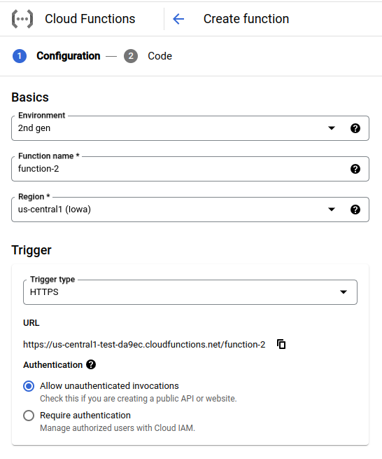
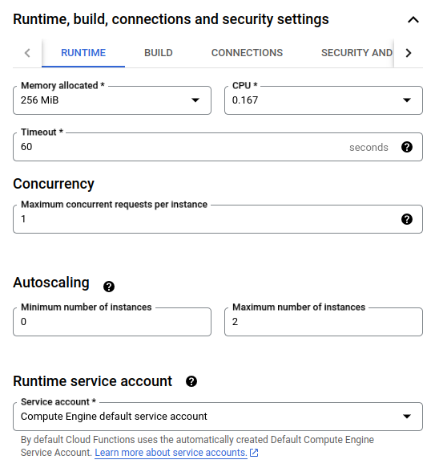
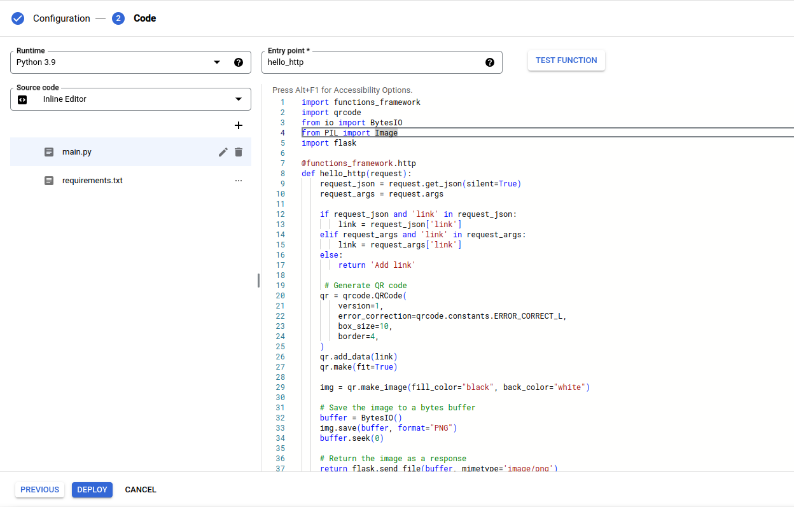

<h3 align="center">QR Code Generator</h3>

  <p align="center">
    Demo of how to setup and deploy Google Cloud function using Python
    <br />
    <a href="https://pratik.tech/gcf-demo"><strong>View Demo »</strong></a>
    <br />
    <br />
</div>

## About The Project

This project demonstrates how to deploy a cloud function on Google Cloud.

## Built With


## Getting Started

### Setting up your Google Cloud account

1. Open the [Google Cloud website](https://cloud.google.com/) and create an account.
2. Create a billing account and activate billing.
3. Create a new project.

### Create a new cloud function

1. Open [Cloud Functions](https://console.cloud.google.com/functions) from the hamburger menu or using the search.
2. Click on **CREATE FUNCTION**.
   <br>
   
3. Add a function name and choose a region.
4. Click on `Allow unauthenticated invocations`.
   <br>
   
5. Open Runtime, build, connections and security settings by clicking on the down arrow.
6. Under autoscaling change the `Minimum number of Instances` to **0** and `Maximum number of Instances` to **2**.
   
7. Click on **NEXT**.

### Code

1. Choose the runtime as `Python 3.9`.
2. Copy the code from `cloud-function.py` and paste it into the `main.py` file.
3. Copy the requirements from `requirements.txt` and paste it into the `requirements.txt` file.
4. Click on **DEPLOY**.
   
5. It usually takes 1-2 minutes deploy the function. Once deployed you will get a URL to trigger the function.
6. You can test the function using this URL by adding `?link=https://yourlink.com`

```
https://us-central1-project-name.cloudfunctions.net/function-2?link=https://yourlink.com
```

7. You can integrate the link in your app. Check the `main.py` for an example.

## License

Distributed under the MIT License. See `LICENSE.txt` for more information.

## Contact

### Pratik Kale

<p>
  <a href="mailto:ppvkale@gmail.com" target="_blank"></a>
  <a href="https://www.linkedin.com/in/pratikkalein" target="_blank"> </a>
  <a href="https://twitter.com/pratikkalein" target="_blank"></a>
  <a href="https://dev.to/pratik_kale" target="_blank"></a>
  <a href="https://instagram.com/pratikkale.in" target="_blank"></a>
</p>

Project Link: [https://github.com/pratikkalein/cloud-function-demo](https://github.com/pratikkalein/cloud-function-demo) <br>
Demo Link : [http://pratik.tech/gcf-demo](http://pratik.tech/gcf-demo)
